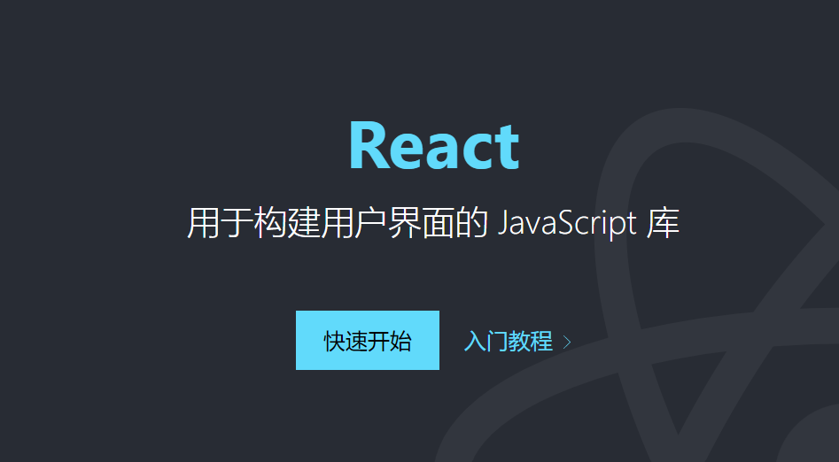
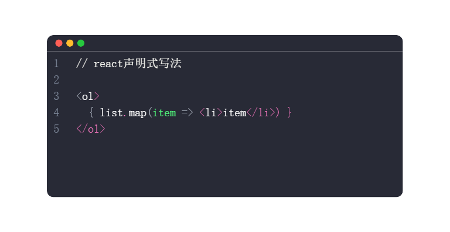
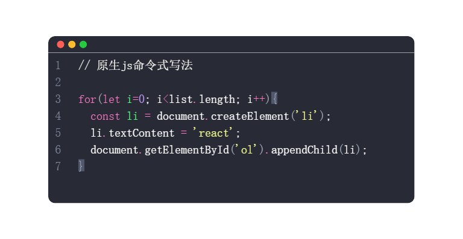

## React是什么
*一个专注于构建用户界面的 JavaScript 库，和 vue 和 angular 并称前端三大框架*
<div>
	
</div>

> React英文文档：https://reactjs.org/

> React中文文档：https://zh-hans.reactjs.org/

## React特点
*1、声明式*
> 声明式的意思就是写页面UI可以跟写HTML一样，抛弃了命令式的繁琐
<div>
	
	
</div>

*2、组件化*
> 组件化可以像搭积木一样构建页面，组件化也能够实现代码复用性和可维护性 <br/>
*3、跨平台*
> react不仅仅可以构建web应用，使用 react-native 还可以构建如安卓和ios的原生应用，一套代码多个平台

## React安装使用
*1、CDN 引入* <br/>
和普通的 JS 库或框架一样，React 也可以从 CDN 引入 <br/>
React 的 CDN引入需要引入 2 个 JS 库文件，即 react 和 react-dom
> react (先引入): ```<script crossorigin src="https://unpkg.com/react@18/umd/react.production.min.js"></script>```

> react-dom (后引入): ```<script crossorigin src="https://unpkg.com/react-dom@18/umd/react-dom.production.min.js"></script>```
	